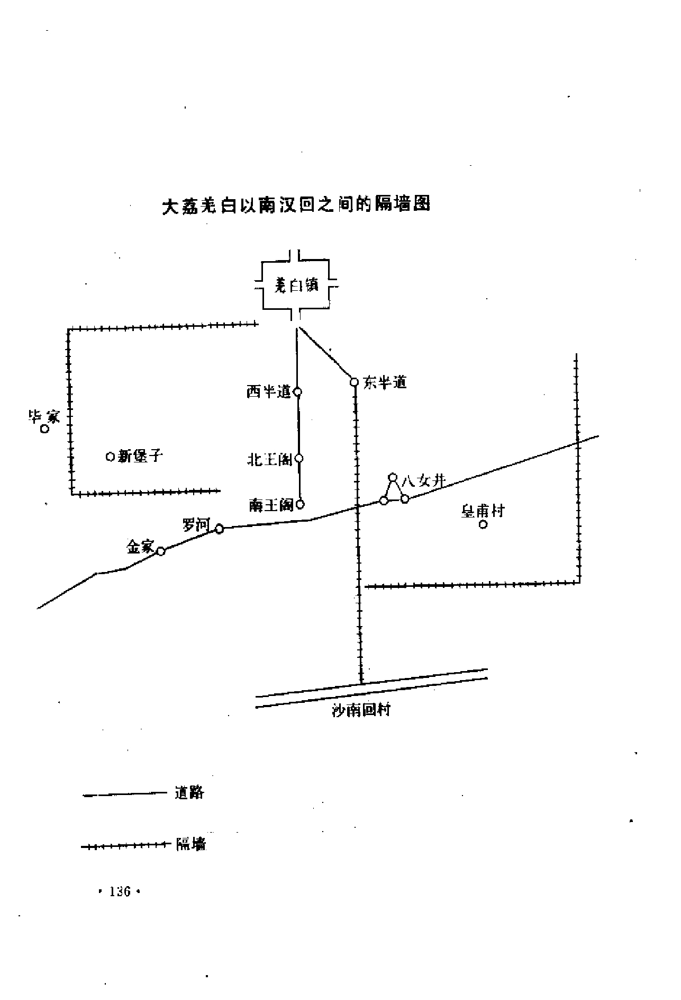

# 四、大荔县调查记录

4 月 10 日，昨夜由华县赶来，晨乘汽车由渭南直达大荔县城。冯增烈同志因病未愈，劝返西安休息。我和刘士莪二人由渭南渡渭河，经上涨、固市、来化镇、羌白镇，再渡洛水，到达大荔县城，住县府内。

县府由文卫科科长乐正哉先生为我们策划调查步骤，同时因为他是羌白镇人，所以又供给了我们许多关于回民起义的资料。县统战部部长生病，在范秉钧同志的帮助下，明日为我们召开座谈会。

下午，范同志引导我们采访了县回族人民代表李先生，他在街上开着一座小杂货铺，原系河南省人，迁到大荔已十多年。又同访清真寺的八阿訇，他也是河南人，新近才从河南到大荔的。清真寺在东关，原来这条街及其附近是一回民聚居区，此寺是城内回民唯一的清真寺。但自同治年间回民起义失败后，回民的田产、地产以及所有的清真寺都没收为官产。当时的统治阶级和地主绅士真恶作剧，把田产、屋产拍卖于汉族农民这还算有 “理” 可说，而对于清真寺则或作为刽子手多隆阿的庙宇，或作为当时死亡的团练头子和团丁的“忠义祠”则不可理解。大荔城内的清真寺，就是在同治四年改为“节义寺”的。

解放以后，我们的党和政府根据大荔回民的要求，改“节义祠”仍为清真寺。这里的回民虽然是从外省迁来的，不是当年大荔城回民子孙，但他们事实上需要一座清真寺，所以政府决定把寺产交归回民，八阿訇现在已经在寺内讲经礼拜了。这一措施，引起了县内外广大回民的热烈拥护。

清真寺的门口，卧着一块石碑，内容是记载同治元年大荔县的“回乱”的，内容没啥价值。寺内廊下又仰卧着一小碑，上刻同治四年刘宗实作的“节义祠创始碑记”，我们摩读一番，大意是说同治四年官府改清真寺为“节义祠”，官府命绅士调查汉民男女死亡的人口，共一万二千多人。又由地主富户们捐款得一百几十两，仍然不够，最后还是八女并与回民有世仇的大地主李姓寡妇吕氏慷慨捐银始成此祠。最后有几句妙文:“因以告殉难诸君曰，回安在哉?今已夺其庐而处之，已足泄此愤。他日官兵追剿时，倘有阴风飒飒，鬼兵出没，使回贼辙乱旗靡，必节义祠之阴灵为之也，亦天道也。”这真是一片鬼话。

另外在大殿壁上三面都嵌有石碑，碑上刻举各村男女死亡者姓名一万二千多人，约与宋佑文所著的《阑幽录》相同。此书在大荔尚可找到，我曾翻阅了若干段，没啥道理。

我们与八阿訇谈了二十分钟。他是河南人，但对陕西的回民历史很注意。他引着我们在各处参观。

回来经大荔师范，访晤该校历史教员王重九先生，谈片刻，邀他明日参加座谈会。他对大荔的回民起义曾经在许多村落里做过调查研究。

晚于灯下看由县文化馆送来的《大荔县续志》。在卷一《事征》内记载同治元年到六年回民起义事颇详。这些资料是经过采访和传说而来的，较一般官书所记者为可靠。兹节录如下:

> 同治元年(1852)四月初，粤匪由商洛窜入陕，自省南殷家卫(今引镇)突出。…… 
> 二十三日乙亥，渭南、华州回匪以砍竹与汉民启衅。至二十五日丁丑，回逆大纵焚杀，猝然祸起，居民联络各村为守御计，郡城戒严。知府朱元庆、知县杨玉章，仓猝请兵不及，躬率绅民力筹防御（城防绅士为王居敬、杨可璠、马健德、梁国佐、李岳龄、杨礼、程卢橘、李向桂、张鹏翼、杨德清、王佑之、赵炳元、梁遇春、孙殿元、邢镇中、李锦文、张鸿翼、石占鳌。勇目有张启祥、王占魁、张殿魁等）。是日逆焰连天。二十六日戊寅，洛河南北居民聚集壮丁御贼于八女井。时贼巢盘踞王阁村，与汉民相持里许，贼伪求成，汉民多散归，贼乃袭攻合围于八女井之二郎庙，死者近千人，洛河以西无能阻御矣。己卯，城内回民蠢动，尽夷之。庚辰，羌白镇陷，县丞罗以丙渡洛东，驻白猴屯。
> <115>五月初，署囗使刘前，署府吕绰，查看回乱，自省至郡带护勇百人。五月二十一日壬寅，贼过洛河至白猴屯一带，县丞罗以丙阵亡，武举梁安国等百人血战死之。二十二日癸卯，贼围郡城，城中惟省勇百人，及洛以南丁壮入城者若干人; 余俱怯弱居民，不任守陴。太守谕令官绅分地管领，日给饮食令饱，自以短带束单衫，手提轻刀，日夜巡历，倦则倚城楼憩息而已。给百姓饭至，则就食之，慰以温言，囗以壮语，或鞭百姓起，则止之曰: “更代歇息可也。”贼辱骂则为曲解曰: “骂我无与尔辈事，勿动也。”百姓感激，誓死守。自回乱起，府尊无时不与绅耆议防守策略，分倾谈，恩谊相接，若家人父子。时封翁朵山修撰，迎养在署，每指授方略，前署府吕，卓有才干，府尊与协力共保危城。维时贼骑驰突城下，喊杀声如群鸦警叫终夜不息，府尊令悬灯外照，防其穴城，并燃油篓席卷抛置城下令通照，虑贼掘地道。内掘城根尺许，塞瓮其上，俾瞽者头入其中听之，贼技竟不能施。一夜贼为云梯，周围十三处，同时争上，均被击下。时城上密布枪炮木石，贼不得近，或顶桌板蒙生牛皮自阵，或载桌柜车上，自藏其下，鞦牛前行，因堆柴草烘烧城门，火焰上及城楼，均经救止。贼又叠累车箱床榻等物于西城外，层积而上，势将及城，城上以大炮轰倒。贼匿北城外砖塔后，用枪铳击城上人，府尊令俟贼渐聚，自东城以炮侧击之，贼不敢复至，又载麦草趋西南城为烧门计，城上放火箭燃其车，火起牛惊逸，贼遂散去。丁未夜，贼焚广城观楼，楼高过城数丈，火发焰起，城内屋宇通明，守陴绅民卒安定不移守界。计围扑郡城凡八昼夜，城内人喘息不遑，最危急时，府尊谓众曰: “夜梦关帝救护，此城必保无虞。”即令舁帝君行像供城上东北隅，众信为神灵护佑，惊慌稍定。又值华州牧濮垚带勇袭贼老巢，贼回援，庚戌围解。廉使怯慑，即欲引去，府尊恳留不可，男女遮马哭诉不得行，廉使疑府尊使民留己也，衔之，因没其劳绩，报上台，遂改檄吕公署府事。(按: 同郡为会垣，左臂东跨黄河，燕晋之要道也。贼初起事，妄欲据此为盘踞地，蚕食关中，窥窃神器，故其攻城也，以全力注之，志在必得。设当时防守偶疏，即后来健将强兵策能收复，保无劳师麋饷，持久旷日乎? 由是言之，府尊八昼夜坚守之力，关系大局何如耶。)
> 先是发逆窜陕者未及渡渭而北，因庐州府逆陈玉成被剿穷蹙，驰书呼援，贼急折回，东出潼关去。
> 回匪猖獗滋甚，时久旱，洛水仅尺许。贼来往皆揭浅而过。(七月)二十日壬寅，成提军明带兵至郡。
> 八月初五日乙卯，成明巡城东，遇贼于八里铺，大败，死伤多人，粮草军器尽被抢去。又张司马某领楚勇三营至郡。
> 九月十二日，以三百人出城，成部数百人随之，遇贼于东门外，贼退败，楚勇暂息作饭，嘱成部戒备之。贼复大至，成部不支，楚勇被歼于苏氏沟，百姓从草桥店一带观者半被掩杀，司马麾余众入城保守。司马军令甚严，部下扰民者按法惩治，民赖以安。
> 〔十月〕二十三日壬寅，胜帅保统兵至郡，甲辰御贼洛河西，大败，遂闭城不出，日上城观望而已。
> （贼在城下呼骂，帅日登城亲闻，绝不为意。时府学教授李学濂题咏有“将军天上人，拥众坐云里”之句。帅宽于贼，而严于民，每夜派总查巡城，稍不称意，法立至，官民皆苦之。李又有诗云：“严城一夜惊悬胆，不怕回回怕总查。”帅部下多发、捻余党，颇滋扰居民房，掠财物，四街罢市。磨麦甫研破，即以为麸尽携去，或少护惜，鞭捶刀剑立下，带伤者比比也，甚至拉耕牛宰以货肉。时帅辕前有兵丁屠牛肆二，无敢是非者。军饷不敷，传绅民捐输不应，则禁刺之，有押毙者）
> 十一月二十六日甲戌，多将军隆阿奉命来援，驻军八里铺。时贼已盘踞黄家庄、黄家营、长城村一带数阅月，去城仅二、三里，胜部意不敢谁何，将军既至，贼犹以为胜部也易之。丙子旦，贼众蜂拥而出，呼号喧闹，且噪且进。时城内官民皆于陴上谛观，贼既过兰家村、草桥店，将军犹不少动，渐逼进约里许，将军乃麾众出，各乘锐气，迎头奋击，贼不能支，辄退却，将军督队追剿，大败贼于邓家营村南。先是将军派马队多人，一股绕出北原下，一股绕城南而西，此时乘胜包抄而进，贼益惶无措，西向奔窜，喘息不囗，死伤无数。其营在黄家庄各处者，尽行弃置军械米粮，迤逦抛掷不顾也。贼奔窜既远，相讶曰: ‘此非胜保兵自何处来也?’(时支发军粮绅士有张逢午、李琯、马沛艾)
> 十二月初二日己卯，官军渡洛时，贼队排列南岸，枪炮栉比，杂以飞箭，势不可近。将军跃马冲过，将士一拥前进，未及抵岸，贼众纷纷逃窜。我军乘胜追杀，遂传令移营洛水南，是夜搭造浮桥以便往来。庚辰，贼来扑营，官军设计迎剿，败贼于背坡村一带，夺回、汉民村庄。辛已，列队出击，仍获大捷，此后连日得胜，擒斩颇多。丁亥，带队出战，令以后军作前队，递转递进，逼贼而前 (所谓滚营法也)。前队迎贼奋击，累战皆捷，迫贼至王阁村，傍晚而还。
> (官军初渡洛河，将军带亲兵二十余人，相度地势，沙苑丛林中突出贼匪数百人，四面围扑，将军令我军以背相倚，奋力格杀数十，贼登时溃散，我军不伤一人)
> 二十六日癸卯，贼计穷乞抚，不纳，仍复移营近逼。乙已，前军近王阁村老巢仅四里许，时王阁村四围立有木城，贼潜谋拆城宵遁，官军四面围定，卒弗得出。丙午，贼遣前次投诚之哈连升等卑辞乞降，将军仍力拒之。
> （时人情汹汹，深恐将军受贼欺侮，邑举人张逢午等具禀陈列其略曰: ‘回性叵测，狡诈非常，图远交以近攻，每朝盟而夕改，自始祸至今，变诈百出，其大端可举者欺荔民一，欺朝、合、澄、蒲之民二，欺府县长官三，欺臬使刘四，前帅五，此前事之尤大彰明较著者。今虽屡挫凶锋，然尚非倾巢覆穴大加惩创，则未必贴然心服。且闻该逆勾结外援力图抗拒，窥其乞抚之辞，实为缓兵之计。’)
> 丁未晦，令所部穆图善率众设伏夹道中，而以前军诱贼，贼至伏起，尽被遮杀，积尸塞途。
> 二年 (1863) 正月初二日己酉。将军率众出队，适贼于王阁村外，掘壕为死守斗，我军鼓众前突，壕遂弗成。庚戌，焚毁羌白镇外贼营八座。时军中饷糈火器缺乏，适回酋乞抚，将军伪应之，迁延十余日，各路军火粮饷踵至，乃谢贼仍复议战。二十八日乙亥，攻羌白镇、王阁村贼巢未克，斩贼千余。丙子，贼三、四万众，倾巢而出。我军迎战于羌白镇外，仍复大捷，擒斩两千余人。是夜，贼劫营三次，皆被轰退。
> 二月丁丑朔，将军亲督各营，复攻羌白镇，克之，遂攻王阁村，克之，贼死伤无数。戊寅，败贼勾结仓渡巨股前来，我军迎战终日，殪毙多名。己卯，贼分股来扑，经我军一鼓杀退。庚辰，贼潜踪抄袭，我军屹立不动，久之贼稍懈，始开壁纵击，贼大败而逸。壬午，烧贼木城。
> (此后时疫大作，十病四五，将军亦疾，力运筹。)
> 十二日戊子，将军扶病出队，憩古柳树下，以所获贼粮散赈灾民，今名其树曰“将军柳”。十七日癸巳，将军扶病察看贼势，计划庞家庄攻取之方。此后连日各营于庞家庄外轮番轰通，俾无休止。二十一日丁酉，败贼于庞家庄外，乘势抄上沙阜，安营四座，高筑炮台，回环轰击，庞家庄之贼不敢再出矣。戊戌，平贼北面长壕。己亥正酣战时，乔店贼分股来援，我军亦分股御之，贼大溃，乃追杀千余人。庚子，攻克庞家庄贼巢，随进攻乔店，亦克之，遂进军渭南之孝义镇。
> (王檄又云:率一德一心之旅，气尽熊罴;奋九天九地之兵，威如枭獍。自东关而趋洛浦，平贼垒者十七营，由南岸以薄沙隈，枭逆酋者八千级)
> 五月，多雨，洛渭大溢，军粮运阻。
> 三年(1864)夏四月十三日癸未，将军多大帅，以围攻周至蓝逆，受炮伤，城南下，卒于军。
> 五年(1866)九月二十八日甲申，捻匪张总愚(张宗禹)大股窜入潼关。
> 十月丙戌朔，贼营散驻华岳庙，东西数十里，南至山麓，北至渭河，马至三河口。署知县孟丕荣，千总李昌林，府幕孙某，邑绅梁遇春、安万全、马成功等带勇防堵渭河。辛卯贼全股西窜。
> 六年(1867)正月十五日庚午黎明，回贼突至八女井，烧毁多公祠，杀伤乡民颇多，随至潘驿镇。辛未，向西北窜去。壬申午后，忽传贼至，乡民纷纷逃避，继而侦探遍询，并无一人见贼者。时朝、合、华三县讹言俱同。
> 二月，暂撤渭上防勇。
> 三月二十三日丁丑，捻匪自西路折回，布满原野，回匪多为向导，城外周三、四十里村落皆贼营，官军登陴固守十余日。贼逼北城，以大炮轰击之，贼溃，遂到处焚掠，其地窖薰死者无算。二十九日癸未，贼至坊舍镇，破廉山一带崖窑，男女死者数十人。
> 四月初，刘提军松山、郭提军宝昌带兵自后追剿，至城北汉村奋击之，贼大败，又西窜。
> 五月二十日，贼数千众复自西北来，居民逃避积聚城下者千百人，车牛数百辆，急待开城，城门关闭，适值大雨滂沱浸湿泥淖，苦楚万状，刘、郭诸军蹑前后蔓延至。
> 六月十八日甲子，回贼数十为群，突至羌白镇，洛河迤西，殆遍贼骑，约六、七百人。次日，贼至近城一带。辛未，魏观察光焘自西路追剿，驻扎洛河西岸。甲戌，贼向朝、合窜去，复折回，魏军迎击之，贼大败而逸。
> 七月初四日己卯，贼复自北路突至樊家堡一带。辛已，日晡，仍窜西北去。
> 九年 (1870) 正月，回贼自西路突至明水村一带。巨股千人驻渭南之耒化镇。次日，渡洛至许原，散漫近城各处。次日，全股窜蒲城界。二十九日乙未，贼复自朝邑北乡入境，去堡仅十里许。次日，延及西北乡一带。
> 二月丁酉朔，贼北窜永丰镇去。初四日，马提军德昭自潼关派兵来援。初九日，贼至汉村以南十余村，是夜贼扑西城，用炮击退。次日，贼散布四乡，焚掠。十一日丁未，复有马贼三、四千自东而西，经北原下至羌白四围数十里，焚杀甚惨。十三、四日贼至王周村各处上坟。十六日壬子贼窜西南去。
> 三月十九日乙酉，贼复至西路窜入边，马数十至羌白镇。丙戌，至城西北高墙寨。丁亥，窜东北去。戊子，仍有数十骑自西而东，由原前出境。”

4月11日，县统战部和文卫科在县文化教育馆为我们召集了各界人士座谈会。

乐科长首先给我们报导了很多有意义的传说，他说:“我是羌白镇的青池村人，原来青池是回民村庄。村里在同治初年有一个回族大地主，名温纪泰，他占有的田地很多，难以数计。家里的耕牛亦很多，相传有卖牛笼头的至村，他全部买下，还不够使用。他家耕地时，牛马成群，如同过会。当时有一附近汉人村在演戏，但群众们不想看戏，而要看温纪泰田里的耕地。温家在当时是县里著名的大地主，所以回民起义了，他不愿参加。后因回众胁迫，始随回军而去，住在甘肃化平县。”[(据《续修大荔县旧志存稿》卷十一耆旧传下记载:“温纪泰，青池村回民，家口数十，同治壬戌，回民将叛，邀纪泰倡首，泰不从，且晓以大义，众汹汹指责之。泰退，毒死全家，己后殉之。”此事记载是可靠的，从此知回族地主阶级皆不愿参加起义。而一般传说，皆不言温纪泰自杀并毒死全家事。甘肃回民传说亦如此，可参考甘肃泾源调查记录。)]

自从回民西迁以后，因其祖先坟墓仍在大荔、渭南，故每年清明不断有人来上坟。然当汉回斗争时，他们是在夜半无人之际前来的，汉人只在第二天看到回民坟上有纸灰。相传温纪泰财宝太多，带不走便埋在地下，有数辆车之多。青池村的西边有马家村，旧亦是回村，相传温家金银埋在此村地下。过去，甘肃回民夜半到此掘过，民国年间住孝义镇的杨礼明团长亦曾派人来挖过，但据我所知，杨某并无取获。

青池一带回墓很多，汉人耕地时，常耕出陶砖陶罐来，有时地下石头把铧口打坏了。

沙苑产的粮食，有麦子、豇豆，但产量不丰，每亩只能获三斗至四斗。遍地都产香胡子，是一种药村，枣子以龙池庵和金家二村所产的最有名，每年产量大约有几百石，黄花菜多产于杨村和陈村。瓜子产于沙苑的西部。

回回以农牧生产为主，经商的少，周围各村镇有汉人经纪人，每年秋季到沙苑收购土产。所收土产，有的交给羌白、孝义一带的富户，有的交给西安来的客商，这些客商，名曰 ‘大庄客’，常住在耒化镇等村。有时，经纪人自己也收货，然后运出，市利数倍。

沙苑周围的汉人富户很多，东边以赵渡镇为最多，西边以孝义镇为最多。西北边的八女井姓李的亦很驰名，他家的布庄在三原、西安都有。

除此以外，大荔县同里村的赵家也很出名，他家的商号以烟庄为主，在甘肃兰州、西安、泾阳、上海都有分号。县城西边的槐垣村李家也是富户，在兰州有金店，号名 ‘祥盛泰’。

龙池庵原来也是回村，至今相传此地土人为 “变种回回”。这一名称是不妥当的，然正可反映百年前这是一回村。”

接着，七十五岁的张静夫先生发表意见，他说: “同治年间的回汉斗争是种族冲突。回民无军器，先派人到华县南山买竹竿，回来围攻八女村。八女村，相传古有八个女子筑成一井，故名。村中李姓为大族，且多财东。财东的城垣被围，家人初以砖头击回众，砖头完了，在箱里找出元宝抛出，但终未打退。回众在该村焚杀甚烈。

清廷初派胜保剿回，胜保军阵容甚盛，但不能打仗，每战必败，不久被调回北京了。又派多隆阿来，由潼关到大荔，第一仗在八里店，回兵败退洛河。后又退羌白镇。多军组织盾牌手，以盾护身前进，以刀砍马足，故回军骑兵大败。多军又多铜炮，羌白镇就是用炮攻下来的。

八女井的李财东，自明代以来，就是富户。一族之内有四大堂号，即‘永远’、‘明远’、‘致远’、‘志远’四堂。经营的商号多以‘万’名，如‘万顺德’、‘万顺贵’，是最有名的。当时称为‘四远’和‘四万’。据我所知，‘万顺德’、‘万顺贵’ 都是布庄。布由湖北运来，到陕西、甘肃各县去卖。钱庄名‘源茂里’，总号在大荔城东库道。银钱除借给一般人外，还借给官府。相传他们的钱财是得自李自成的，在李自成败后退经八女村附近的王店时，因后有追兵，所以把元宝埋在地下，此元宝后为李家所得，所以他家常有明代的元宝在外流通。

李氏的银两原来也埋在地下，回回攻八女村时，并没有掘他们的银两，倒是多隆阿到大荔以后，有一个时期军粮、火器皆告贫乏，所以派人到八女村偷挖了李氏的埋银。[(关于多隆阿偷挖李氏埋银事，在同治元年远近传说，至今成为疑案。然观《续修大荔县旧志存稿・耆旧传・李春源传》对此事已充分透露。传云: “李春源，字莲舫，八女井人。……花门之变，家窖金百万，为盗窃发，肩金过多帅营门，被军士查获，拘见将军，多公根究得实，时军正乏食，此盗谓之曰: ‘尔辈鼠窃狗偷，目无法纪，竟敢发人金穴，罪无可道。然吾为国讨贼，饷适缺乏，此正危急存亡之秋，若辈奸谋适露于此，天其或者以此佐军需乎? 姑尔命，其导兵士往取。吾当请金主晓以大义。”去后，随请春源至，优以上宾，具白盗发金事，拘盗证之。……春源甫十四龄，大义激发，即慷慨答曰: ……‘大军天降，本思输饷助殄凶丑，今愿全数奉上。’……多帅大加奖谕，仍奏请奖官阶。”从这段记载，盗窃李氏百万金而肩过多隆阿营门，而多亦言正危急存亡之秋，天其以此佐军需，其为多派人窃掘，当无疑义。)]因此，李氏财东对多隆阿十分不满。多隆阿死后，大荔县各处皆建多公祠，而八女井独无多公祠，原因在此。”

随后李蔚若先生补充发言，他五十六岁，大荔县城里人。他说: “回民起义原因，是由于汉人多，回人少而性颇顽强所致。回、汉杂居时，常有无赖汉人侮辱回民。有一汉人以猪肉触到回民的衣衿，回民当面就把衣衿割去，遂至成讼，汉官不仅不能解决纠纷，且唬吓回民说: ‘拿猪肉触你的衣衿，你便割去衣衿，若拿猪肠绕你的颈项，你也持刀割去你的头吗?’此回民听后，愤怒万分，然以人少势微，不敢和汉官为敌。”这段报导，虽然很简短，但很重要，大汉族主义也必是产生汉、回冲突的一个重要因素。

后由王重九先生报告他对此问题调查的结果。他说:

“大荔回民原集居于县西南的各个乡村，共三十六个村落。

大荔的回民起义，传说是由于‘地盘相争’。沙苑里头的村庄是回民，沙苑之外的南北各村是汉人。回民善于农事，会经营沙地，护沙的工作做得很好。白马营的粮食产量很高，从前人称为‘金粮’的产地。从前县里的粮税分别为金粮、银粮、铜粮、铁粮、锡粮五种，‘金粮’最高，‘锡粮’最低。把沙田经营成‘金粮’的产区，是很不容易的，回回的人口众多，自然就向外面发展，于是土地便发生了问题。同治年前，回民土地问题发生于沙苑的西北一带，即王阁村一带。

八女井有‘四万’李家，亦称‘万顺李’。李姓钱多，常挟官势以欺压回民。回民强悍，相持不下，所以常到大荔县兴讼，而大荔县官往往左汉右回。同州知府判案不公，判案结果常是:杀十个回民，以一汉抵命; 杀十个以下，便以鸡犬抵命了事。回民中有作衙役的，把此消息传达于回众，回众于是大愤，聚众起事，互相斗殴。

又沙地冬日草死，回民就须牧羊于沙苑以北。偶有汉民冬麦被吃，汉人便把羊捉来杀了。加以好事者以石头投击羊群，羊群便乱踏汉人的麦地，因而事态更为扩大。

在王阁村与八女井之间，汉人地主和农民筑有拦羊墙。自此墙筑成，便成为后来回汉斗争的战线。

回、汉既经不和，有事固然生事，没事也常寻事，于是汉回相争不已。

同治元年四月二十四日，羌白镇逢节过会。羌白是汉人市镇，商业很盛。当天沙苑回民与会者特多，将布匹、木竿等物收买一空，以大车满载而归。第二天，四月二十五日，回回联合动手，先向八女村进攻。

事前，八女村李家雇枪手很多，常对回民加以威胁。四月初又召集附近各村民团壮丁几千人，住八女井庙中，准备向回村进攻。回回见八女井人多势众，先倡议和，李姓财东也答应议和，于是准备稍懈。四月二十五日午时，八女井的外村乡民调出午餐，只有本村壮丁巡守，王阁村回众趁此机会便向八女井进攻，旋即攻下。

攻八女井的回众，是由南王阁出发的。南王阁原为一回村，有回民一千多户，先攻北二里的汉村北王阁。北王阁既经攻下，于是联合远近村庄的回民进攻八女井。此时回民中的妇女老幼则退居于乔店。

此系回众向外攻打的第一次。随后又占领了羌白镇。

五月二十一日，回众渡洛河，进攻同州城。

渭北各村的回民原来调往渭河以南攻华州城，只围攻一日，不曾攻下。听说大荔王阁村人打同州城了，所以即渡河北上，到大荔一同攻打同州城，此时回军的大营在黄家营（在州城之西北）。

黄家营的回军，除拨了一支攻同州城外，还拨了一支北攻唐家集和东西韩村，后又北上攻澄城，此为一路。

原来在五月初，渭南的回众已入大荔境内，经十里它村、苏村、陈村、杨村，这是沙南的一路，最后到达大荔、朝邑交界的地方。至六月初一，回众由杨村一带攻打朝邑。路过的村庄有些是汉人，有些是一种汉化了的蒙古人，他们逃入了南山。这一带的汉人和蒙古人素与回回不睦。每逢唱戏不给回民看。当地的拜家、铁家、达家、沙家，原来都是元代蒙古人的后裔。附近汉人们常说：‘不是回回，是奥台’。此‘奥台’即是指蒙古人而言。

沙北一路，分出一支东出攻朝邑，但也只到了大荔朝邑的边界。当时回军宣言: ‘只杀大荔，不杀朝邑。’回军到沙苑东北的西阳村时，在庙前曾插一旗，上书: ‘真龙天子马百龄，兴回灭汉才太平’。这便是当年回民起兵的口号。

大荔回军占据了各村庄以后，沙南与沙北的各支合流，然后直向朝邑进攻，一直攻至朝邑县城。当时朝邑的守城将官名王永庆，是太平军的叛徒，绰号‘王疤眼’。因为城尚守的稳，所以没被回军打下。以后，一部分回军到达黄河岸，集合于黄河滩。他们所以至此，主要目的是为了搜索逃难者的金银财宝。

大荔、朝邑的大地主在办团歼回的目标上是相互合作的。当回众在八女井一带打仗时，朝邑大地主联合起来，支援沿路攻打回民的团丁。他们在朝邑的霸城村（靠近大荔的西阳村）设有仓围，贮存粮食。另外还做了馍馍，运给大荔团丁，希望他们早日成功，不至使回变影响到朝邑。（这段话是住在大荔县城的朝邑人邢玉堂告我说的）

回军在大荔境内攻杀很烈，所到村落很多。只有西北一隅的山中为当时难民聚集之所，回军未到。

多隆阿进入潼关以后，经朝邑的仓头镇（不是渭南的仓头镇）到达同州。初驻兵八里店，未进县城。以后分兵三路向回军的所据地进攻: 一路西进，解了同州之围; 一路为马队，向西北进攻下了东西韩村二个据点，又一路向西南，截堵了洛河以北的回民援兵。

然而回汉人民之间，虽在干戈互杀之日，他们彼此之间的友谊仍然是保持着的。相传回民西迁之前，曾发动三十六村回民整装待发。其中有些回民和汉民无仇怨而相善者，皆不愿迁。到非迁不可时，与汉族邻友相遇于道路，便对汉人说：‘亲家，不对啦！ 要分离啦！’又相传南王阁回族某富户，家里请汉人为塾师。平时主客相处很好，先生教书亦佳。至动手前夕，各回户相约杀汉人。主人对塾师不忍下手，先生闻知，跪而求救。主人为其设法：先生化装为病人，睡车内，主人执鞭，到闹市中，放先生脱险。由此，可以说明，虽在兵燹之中，回汉友谊仍然是滋长的。

回民杀汉人，是怕汉人为仇敌通风报信。相传南王阁村回民在动手前，以重工资招徕远近铁匠打造各式兵器。造好以后，回民把铁匠都杀掉了，只有一铁匠从回村到州城买铜，未及于难。在返王阁村途中，知道明日回回要动手了，遂逃到州府告密。”

最后还有一位苏振娃老人，是一个小贩，少年时候常挑杂货到沙苑外各村去卖。他说: “听人说回回当年的兵器，以‘关山刀’为最多。刀一边有刃，一边钝，原系刀客所操。这些‘关山刀’都是被招来汉人铁匠在南王阁村制造的。”

谈罢已经下午二时许，共摄一影。此次座谈者共十余人，择其重要者纪录如上。

晚间走访惠通渠水利局秘书王子英，六十多岁，是一民盟盟员，曾经参加过续修县志稿的工作。他说: “回民起义是由于民族压迫。回民原居沙苑及沙边各地——青池、王桥以及八女村以南各村。州府官吏处理回汉诉讼时总是左汉右回，因此回民大愤。

回回之中也有出卖自己的民族利益的。当大荔城被回军围困时，有一家回人名马官府，住在东街原天主堂的西边（现在作了拖拉机站）。他听说城内回回要内应造反了，就向知府告密。知府知悉，命团练把城内回民屠尽，只留了告密者一家，后来大荔的回民全部走了，还有些是死了，马官府的屋宇院落很漂亮，于是就改为‘多公祠’。

当时城外汉人除了民团外，一般人没有组织。在回民来时，妇女老弱皆藏于窖中。回兵对壮丁和男孩特别仇视。

汉民集居于小寨中者皆被杀，如刘官营即是一例。各村男女老幼死于同日同时，所以子孙们就以此日为‘总忌日’，到时集体祭奠死者。

回汉交战始于八女井 (亦称八女村或八鱼乡)，富户李姓，到同治年已有一、二百年历史。其家商业以布庄为主，从湖北贩布，总号设在三原。家里养有打手，多系村内外的年轻小伙子。

多隆阿来时，驻扎八里店，而当时回回的大营则在黄家庄 (有时误称为何家庄)。当时大荔城正被围，城外汉民移入者甚多，廊前树下到处是人。井水不够用，大小便都成问题。

多军由八里店分二路进军: 一路是骑兵，向北到了铁镰山 (古代的商颜山) 南面对黄家庄取包围形势; 一路是盾牌手持刀，以断回军骑马的蹄。当时有人在城头上望见，多军在挑城壕，回回军很不在意，距回兵百步远时始发号前攻，回不敌而退，城围始解，多军至黄家营的南边，见黄家营已被北路军所占。回回军不得已始退洛河以南据守。

多军打羌白用铜炮和鸟枪。羌白城南有奎星楼及城门楼，皆被多军打毁。羌白镇被破，回军始退乔店。

‘破产’地有二十五顷余，拨归丰登书院及冯翊书院，收其地租为每年经费。”

这一席话，大致可与今日座谈会上发言相印证。

4 月 12 日，坐运粮的马车经过沙苑到达县东南角的杨村。马车因为预先没雇好，直至下午 1 时始启程，4 时始到达杨村。

路过石槽村，南行二里许便是沙苑。

关于沙苑，中国史志皆言其地自古为一良好牧场。杜甫《沙苑行》云: “君不见左辅白沙如白水，缭以周墙百余里。龙媒昔是渥洼生，汗血今称献于此。苑中騋牝三千匹，丰草青青寒不死。食之豪健西域无，每岁攻驹冠边鄙。”《唐六典》言, 唐时沙苑监掌牧养陇右诸牧牛羊, 有司每岁献马一百五十匹, 当即杜诗所谓 “春秋二时归至尊, 至尊内外马盈亿”。

《水经注》谓, 洛水东经沙阜北, 其东西八十里, 南北三十里, 俗名之曰 “沙苑”。杜诗谓周围百余里, 与《水经注》所称相合。今沙苑面积, 东西长约四十公里, 南北宽约十公里上下,南北距离缩小, 盖以沙苑南北耕地面积扩大的缘故。

与回族史有关者, 即回纥入驻沙苑之事。大荔新旧志书及陕西古老传说皆言, 近代沙苑之回族即唐代沙苑之回纥。关于回回是否回纥问题, 清初顾炎武主张二者是相同的, 但钱大昕则主张二者非一。回回的来源, 以我的看法, 是多元的。其祖源有的来自大食, 有的来自波斯, 有的来自中亚各国, 其中一部分, 尤其是同州沙苑部分, 可能是从前的回纥。此说当另为文说之。于此我们当一谈者, 就是回纥是何时驻入沙苑的? 诗人杜甫的《留花门》一诗即咏此事。诗云：

> 花门天骄子, 饱肉气勇决。 
> 高秋马肥健, 挟矢射汉月。 
> 自古以为患, 诗人厌薄伐。 
> 修德使其来, 羁縻固不绝。 
> 口为倾国至, 出入暗金阙。 
> 中原有驱除, 稔忍用此物。 
> 公主歌黄鹄, 君王指白日。 
> 连云屯左辅, 百里见积雪。
> 长战鸟休飞, 哀茄曙幽咽。
> 田家最恐惧，麦倒桑枝折。 
> 沙苑临清渭，泉香草丰洁。 
> 渡河不用船，千骑常激烈。 
> 胡骑逾太行，杂种抵京室。 
> 花门既须留，原野转萧瑟。

杜甫此诗约作于唐肃宗至德二年 (757 年) 回纥兵马屯居沙苑以后。回纥叶护磨延啜请兵马屯沙苑事，见于《唐书·回纥传》和《通鉴》。《通鉴》卷二百二十记载，至德二年十月“癸酉回纥叶护自东京还，上命百官迎之于长乐驿（在浐桥东）。上与宴于宣政殿。叶护奏以军中马少，请留其兵于沙苑，自归取马，愿为陛下扫除范阳余孽。上赐而遣之”。此为回纥兵屯沙苑之始。杜诗所咏“连云屯左辅，百里见积雪”言回纥兵之多。楼大防云：“回纥人衣冠皆白，故云如积雪。”此解释近理。会昌五年，李德裕著《上尊号玉册文》言：“曩者北狄矜功，耗蠹中国，种类磐牙，根柢封殖，异术肺腑，缟衣如荼，挟邪作蛊，浸淫宇内，倒悬不解，百有馀年”。当指唐肃宗时回纥入居中国之事，沙苑屯兵，其一例也。会昌五年为公元 845 年，此之回纥至中国百有余年，则回纥入中国当在肃宗以前。否则李卫公的计算有误。诗云：“田家最恐惧，麦倒桑枝折”，此言牧马妨害麦桑之田家。回纥何时迁出沙苑虽史无明文，但由《上尊号玉册文》所言“倒悬不解百有余年”，则回纥并未迁出。即以杜诗考之，诗云“公主歌黄鹄，君王指白日”，此所谓公主当指宁国公主嫁英武威远毗伽阙可汗磨延啜之事。此事在乾元元年（758 年）。诗又云：“胡骑逾太行，杂种抵京室”。钱谦益说指史思明由魏州引兵过相州事，然与“杂种抵京室”有何关系呢？翻阅唐史，似指乾元二年（759 年）回纥骨啜特勤帝德等十五人自相州奔还西京事。总之, 由《留花门》一诗所述, 沙苑回纥在杜甫作此诗时并未迁出。

840 年以后, 回纥汗国崩溃, 部众四散。唐会昌二、三年 (842 至 843 年), 南来回纥降唐者甚多。刘沔奏: “归义军回纥三千余人及酋长四十三人, 准诏分隶诸道, 皆大呼, 连营据滹沱河。不肯从命, 已尽诛之。”又说: “回纥降幽州者, 前后三万余人, 皆散隶诸道。” (《通鉴》卷二四七)《会昌一品集》中李德裕于会昌二年拟遣田牟招降回纥, 谓 “如有降虏, 旋给粮食, 递过太原取优赏, 不得留在天德”。又《论天德军提到回纥生口等状》云: “望付翰林赐田牟仲武诏, 前后更有此类, 便递送太原, 分配在诸州安置。” (《会昌一品集》卷十三) 李德裕上述诸奏, 唐武宗皆从其议 (《通鉴》卷二四六)。然则回纥之由幽州及天德投降者, 经过太原, 然后分配诸道, 皆系事实。其分配诸道者, 有一部分驻扎到沙苑, 是非常可能的。但目前我们尚无可资证明的史料。

古代的沙苑, 杜诗云: “丰草青青寒不死”。又云: “泉香草丰洁”。这是指唐代的沙苑。清代周铭旂的《疏凿白马池旧渠碑记》云沙苑 “桃杏枣梨不下数十万株”。最近西北大学地理系余汉章同志调查沙苑的地史时曾作出如下的结论, 说: “就大荔县志记载和访问老乡所知, 从前这块地区是回民居住。当时草木茂盛, 树荫遮天, 即使有西进的沙粒都能被植物所固定, 只能增加固定沙地的厚度, 而不足以形成流沙。但近几十年来汉人抢占了这块土地, 汉人迁入后, 滥事开垦, 从事农耕, 于是植物被破坏, 沙层暴露, 被风翻起, 流沙才大大的猖獗起来的。” (《渭洛河三角带沙苑的沙丘地形》, 1956 年西大地理系科学讨论会报告) 从这些史料看, 令人真有今不如昔之感。

在沙苑的北面, 种麦很多。树木有枣树 (最多)、杏树、李树、梨树。到了沙里, 麦子就少得很了, 因为风沙大, 麦生出来就被掩盖。有的农民把麦田用土垣围着, 沙土便隔离在外围。但没有围垣, 庄稼生长就困难了。沙苑的池沼在过去很多, 面积也大, 后来风沙时起, 池沼遂被掩没。现在能够称为湖泊的,只麻子池一处, 长约二千公尺, 宽五、六百公尺, 水深二公尺。湖泊的形状成东西方向, 这表明他们是古河道的遗迹。另外, 还有一个太白池, 面积不大, 水深达半公尺。白马营的湖泊水深还不到半公尺。有湖泊的地方杂草就较多, 土质较肥, 宜于种植和栽培树木。农民的大村落主要就分布在这些地方。

我们沿大华公路（大荔到华阴）南下, 目力所及只能看到管子池和帖家二村。管子池村有姓达的, 帖家有姓帖的, 原来都是蒙古人, 现在语言、衣饰、习俗与汉人完全一致。

出沙之后, 望到新庄和北庄, 都是汉人村落。再行二、三里, 便到阳村, 阳村是沙苑之阳拥有一千多户的大镇。阳村的城是由同治六年到光绪五年筑成的, 立有碑记记其事。原来的土城在同治元年被回回打垮。回回被逐以后, 汉人修城, 砖石不够了, 到西北七、八里远的马家村掘回回的坟墓。那里原有许多回回的富户, 一般人所说的马阁老就是此村人。墓里有墓志铭石碑, 都以阿拉伯文写成, 当时农民就把这些石碑运回来竖在城门的左右, 作为城门谯楼的奠基石。我们择其五碑字迹尚可摩读者, 由刘士莪拓下, 后来带到西安清真寺, 阿訇们说,这是早年回回死后的墓志。

到村里, 会晤赵村长和党支书。支书同志领我们在村内外各处看古迹和碑记。一连看到了十几座碑, 其中有许多是记载同治初年回汉斗争的事实的。在城的东南隅原有多隆阿庙, 庙为一小阁, 现仍在, 但是多隆阿的塑象却被搬到西门下面的土窟内了。多隆阿当年在关中很有名气, 他死在周至, 所以周至人把他当作为城隍爷。

晚上, 由村内一位老干部引我们去拜访老农雷登云和另外一位老农李须丰。雷登云, 字雨田, 本村中农, 今年七十二岁了, 他供给了我们很多资料。

他说: “回回在同治年前居住在沙苑三十六村的村名是: 丁家、马家、小园子、大园子、老庄子、北丁家、南丁家、伍家、草滩子、东营里、西营里、白马营、海道子、潘邑、车村、禹家、乔店、羌白、秦家庄、南营里、沙洼、青池、上沙洼、老庄子、仓头、南王阁、沙南、十里滩、马家洼。”上面所说的村名不够三十六个, 其中可能有不是的（如羌白和潘邑）或者是重复的, 但有供参考的价值。

他说: “同治年前, 回回的粮不归大荔县直收, 是由羌白分县的县佐征收的, 征齐后转交给大荔县。

民国二、三年, 湖北人迁到大小园子和白马营一带, 称为 ‘湖北里’。还有 ‘新仁义里’, 包括沙苑里各村, 都是外来户。此 ‘二里’的土地都是 ‘叛产’地。

大荔县经过同治年间的事, 人口减少了十多万口。”

接着, 他说: “关于同治年间的事, 民间流行着一首《荒乱歌》, 这歌是:

> 同治王登了基陕西大乱,
> 长毛贼直反到商州洛南。
> 各县分出告示百姓团练,
> 将传单直传到金斗潼关。
> 孝义镇它本是渭南所管,
> 赵老五也算是有钱富汉。

渭南赵老五招了二百名民兵保卫孝义镇自己的家财, 其中一百名是回回, 一百名是汉人。回汉民兵在营里不和, 回回到华州砍竹竿, 不给钱伤了人命, 因而到渭南县告状了。当时知县濮垚唬吓回回说: “打死一汉, 十回偿命; 打死十回, 一汉偿命。”回回听了, 认为判断不公, 所以回去就聚众造反。后来孝义镇的团练到秦家点火烧房, 回回跟着就夺取孝义镇, 火烧南刘家和西李家, 在《荒乱歌》中有两句是:

> 先烧南刘家房屋村院,
> 西李家只烧得着实可怜!

起事的时间正是五月初一日, 各村汉人团练, 听说回回造反, 集合进攻回村。而各回村的回回亦麇集起来, 由西而东, 杀烧过来。他们先到沙苑, 后经苏村、洪善村、溢渡村, 最后又到阳村和拜家, 时间也是五月初一日。一日之内, 由西而东烧杀殆遍。

回兵初宣言只杀大荔, 不杀朝邑, 所以各村汉人多逃到了朝邑县。但半月以后, 回兵也杀奔朝邑去了。因此逃出去的人们, 有的逃到合阳, 有的逃往山西。一直到同治二年五月初, 时局平定了, 外逃的人们才相继回来。

同治元年, 本村李兴惠一家七十多口, 其中青年壮丁都去打回回去了。青年阵亡的和家里被杀的共三十多口。率领壮丁的头目名李清濂, 无子, 只有一女。家里有钱, 人很能干, 所以人们都听他的指挥。村里壮丁皆无枪, 只以刀、干及农具为武器。皇帝对于李家特加恩典, 在门上挂了 “忠孝节烈” 的牌匾。

大荔回民兵是由多隆阿征服了的。多隆阿有四个姓雷、廉、穆、朱的先行官, 与回民在何家庄 (黄家庄) 大战, 最后是回回败了。回回南渡洛河, 退守仓头镇, 以后又退守苏家沟。

回营中的军官, 据打羌白皮影戏所说有: 阿訇, 是马家人;丁长春, 是丁家人; 长伦, 是海道子人; 尕子老刘, 是沙洼人。其中阿訇挂帅。这是老人们的传说, 也许是不可靠的。”

雷老汉很健谈, 上述各条是我提出许多问题他回答的。有的不可信, 如先攻孝义一事。有的很有历史价值, 如说大荔县的粮税和回军由西而东的出兵路线。坐在一旁的李须丰, 七十七岁了, 是个贫农, 人很忠厚, 不愿发言。他只说了几句, 说他少年时在王阁村作雇工, 听人说早年只有南王阁有回回, 北王阁没有。所以有人说南王阁以北尚有回村的话, 是可怀疑的。

4 月 13 日, 我们留在阳村。此日是阴历三月初三日, 阳村过古庙会, 远近村民男女来此赶会的很多。妇女和老弱大部分坐着四轮车即华州人所谓 “回回车” 前来, 熙熙攘攘, 饶有古风。我们作调查工作的人, 应当利用各村来人的机会进行访问,但是村人民委员会的同志们都外出了, 故未能进行。上午, 我们只能约几位村里的农民谈话, 士莪到各处去拓碑。

约来的村人有石肇基、钱乃品、朱秀谦, 还有一位卢姓的老乡共四位, 年龄都是五、六十以上了。同治年前的阳村, 据我们了解, 钱、尚、李三家是富户, 石家的人口多, 并不怎么有钱。今天来的钱乃品, 就是钱家的后人。他带来了两幅画, 名 “赴洪镇图”, 每幅各长六十七市寸, 宽二十七市寸, 绘制很工,是钱乃品的祖父钱希凤绘的。希凤是当时有名的绘匠, 据说三原贺瑞麟曾约他去绘画, 但他没有去。他亲身经过了一些灾难,回来绘为图画, 使后世的子孙纪念他。

钱乃品一边叙述他祖父遭遇的经过, 一边展开 “赴洪镇图”给我们看。他说:

“我有三个祖父。二个祖父出外经商去了, 只留下一个祖父,即钱希风, 在家里以绘工为业。家里有老幼妇女四人, 小孩二人。同治元年五月初, 回回杀到村里, 祖父偕同家人出走。先过敷水镇, 往华阴县的洪镇去, 后来听说回兵攻破龙凤山 (在华县), 又负母携幼, 同他的姨父 (亦是岳父) 迁居于鹿泉村的龙王庙。这两幅画就是叙述我祖父偕同家人逃难的经过的。”我们给这两幅图拍了照。

跟着我们又看石家所存留下来的 “苦节图”。

石肇基, 六十二岁, 中农, 他给我们叙述当年的回事说:

“同治元年五月初一日, 回回由大荔县的西大村烧杀到阳村。当时回回宣言不烧朝邑, 所以村人都逃入朝邑县。但到六月初一日, 又烧杀到朝邑县了, 一直烧到黄河边上。我家祖先逃到朝邑的仁义村。后来听说回回杀来了, 又东逃至三河口。六月初一日, 回兵追来了, 全家人在船上生活了五日。以后, 不能回来, 便逃往山西永济县的可河镇了。直到同治二年五月, 回回退了, 我家才渡河返回陕西, 暂居于华阴县的南洛村, 距阳村十里。当时所以不回阳村, 是因为怕回回再来, 而且当时的阳村已成为一片瓦砾滩了。”

说完之后, 展开 “苦节图” 给我们解释。“苦节图” 共两大幅, 每幅长九尺九寸, 宽五尺三寸。每幅之内, 有六幅小图, 两行, 每行三幅。两大幅共包括小图十二幅。这些图, 是由当时本村绘匠王坤山 (名金锁) 画的。前一幅由孙信甫题词, 后一幅由王信明道人题词。词句鄙俚, 字体不雅, 与绘工不相称。但从孙的题词中尚可看出当年回军的首领与出兵日期, 兹照录于下:

“同治纪元, 花门跋扈, 贼匪蜂起。五月朔, 自苏村来, 一律蹂躏。卓五贼逼近, 命子御贼, 留二孤与伯道囗经过处, 种种危险, 难以枚举。长途数百里, 出入锋镝中, 履险如夷, 卒无以虑。人咸谓公之隐德所致云。”

从以上题跋, 可知到阳村的回回是五月初一日由苏村来的,与以上所述雷登云, 石肇基二人的谈话相合, 并与《续修大荔县旧志存稿》耆旧传中王重学传所记相合。传云: “同治元年五月朔, 回大至, 逼杨村。” 石肇基又从第一大幅起, 一一给我们加以解释:

第一大幅:

第一图, 是述在同治元年五月一日, 回兵来村焚毁房屋, 石氏兄弟三人武装与回兵斗争。

第二图, 是述六月一日全家由仁义村迁到三河口。

第三图, 是述石老三 (名生之) 腰上挎刀到落凤村讨债, 路上遇到回兵逃命。

第四图, 是述全家搬到渡黄河的船上。

第五图, 是正在渡黄河。

第六图, 是述刚渡过河, 回兵从后面追来。

第二大幅:

第一图, 是述石氏兄弟到永济后, 以贩硷为生。

第二图, 是述兄弟二人, 一生病, 相偕以运粮为生。

第三图, 是述全家从山西永济迁回, 在路上的情况。

第四图, 是述回到陕西后, 渡渭河, 人多争船, 兄弟三人,老二拉老三上岸, 幸免于难。

第五图, 是述家人男女拾野麦充饥。

第六图, 是述村人到羌白镇官仓领粮, 途中为官兵盘查。

上述二大幅, 十二图, 讲述完了, 拍了照。

最后, 我还问了他们留此图案, 作何用处? 他们说: “每年正月初一、十五祭祖, 以作纪念。”离村以后, 我曾把这种情况反映于有关部门, 希望把这些图案作为历史文物收归文管会或博物馆, 以免长期流传民间, 对回汉感情发生不良的影响。

下午, 我到距阳村东北三里路的拜家村, 访问了几个拜姓的村干部和农民。他们拿出族谱和祖先图案给我看。在村公所还有一块石碑, 碑文是记载咸丰五年, 拜家的祖先拜住奉旨入大荔忠义祠的经过。综合这些史料看, 这一带的拜、铁、达等姓的确是蒙古人, 他的祖先是在明代初年从河北涿州迁到这里来的。

居住在拜家村的蒙古人约二百七十户, 住在帖家村的蒙古人约二百多户, 住在官子池的蒙古人, 只有十多户。此外, 他们同姓同族人散在大荔陈村和大壕营、渭南小寨、商州会遇村、山西运城县、河南洛阳的各有若干户。达姓的蒙古人, 据说原来姓哈。

《拜氏家谱・世由篇》说, 拜氏是元代初年木华黎的后人。至元大德、至治间的拜住始姓拜。拜住于至治二年死于上都, 葬于平江。至明, 拜住之子笃麟降明, 奉命由涿州经山西迁居大荔沙苑。拜住的遗骨亦迁葬于此。据本村拜家后人拜锡麟谈: “拜家与达家世通婚姻。后来亦和阳村汉人通婚。初拜姓与帖姓不睦, 原因是拜住丞相当年是被帖失御史刺死的, 有此世仇, 故不相婚姻。直到清光绪年间两姓才开始通婚。”又谈: “帖、达、拜三姓蒙古人是同时迁入沙苑的。又元代的托托与拜住原是一族。”

村公所那一石碑, 是由大荔文庙西忠义祠运回来的。碑文的前题是:《先忠献公奉旨入祀记》。碑文一开始就说:“考元史自忠宣孔温窟哇佐太祖,传忠武木华黎,忠定孛鲁,俱封鲁国王。武靖霸都鲁,忠宪安童,忠简兀都带,盖七祀而至忠献,俱封东平王。”此文与族谱所记相同。

拜住的墓在村南,坟上有两个明代的碑,只题名,无别的文字记载。墓和碑都是坐西朝东。

最后和老乡们谈到同治元年的回民起义,他们之中发言较多的是拜锡麟,其余的人加以补充,他说:

“同治年间以前,回回所在的村落有樊家堡、龙池庵、青池、乔店、禹家、沙南、东西海道子、东西白马营、南北草滩、北丁家、伍家、老庄子、马家、大小园子、南丁家、潘邑、车村、秦家庄、南北营里(即南北白马营)、仓头、石碑滩、马家洼、三家庄等等。

当时确有从官府传来的鸡毛传帖,叫各村汉人组织起来,屠杀回民。我的伯父拜兴兰,才十五、六岁,也持矛去打回回。但回回兵马很多,自己撑不住了,才跑往山西的赵村。

回回初来, 宣言不杀朝邑人。当时民间有“天不灭曹, 回不杀朝”之谣。有些朝邑人准备开水, 迎接回军。但回军一到,对朝邑人也是杀, 一直杀到黄河岸上。

回回去后, 所留的田亩称为‘叛产’。叛产的粮作为办学校之用。自阳村以西北, 都是叛产, 官府招人领地, 拜家和阳村的农民不敢领, 怕回回报仇。沙苑的田, 最初是由商州人来领的, 称‘老八家’, 即李、孔、黎、刘、王、张等八姓。顶好的地, 他们大致都占了。后边来的, 是山东人, 住北丁家和伍家二村。河南、湖北人相继亦来, 分住各村, 现在沙苑农民籍贯,有七省十三县之多。”

我也问了他们同治年前大荔县的财东住哪几村。他们想了想, 一致说: “八女井姓李的财东是开布庄; 同里村姓赵的财东是开烟庄。还有南庄姓陶的, 涂家滩姓涂的, 也都因做生意发了财。”

4 月 14 日上午, 我们坐马车回大荔县城。中间经过石槽村,我下车访问了两个年纪大的老农。一个是潘月溪, 年七十七岁;一个是潘喜儿, 年七十三岁。他们说: “回回起手, 先打八女村。讲和不成, 开火了。后来回回打到石槽村, 把房子烧了, 只留有两家没有烧。此后回回又打到朝邑县。多大人领兵在马家亭子 (即马家坟) 打一仗, 回回才西退。朝邑县守城的, 是王疤眼, 把城守住了。回回来时, 村人多逃往大荔城, 在城隍庙搭棚住, 回回走了几年以后, 村里的人才筑了个城, 到现在有八十八年了。”

下午 2 时才到大荔城, 仍住县府。去访王重九先生, 谈的问题很多。(一) 我问他多军攻马家亭子的事在何时? 他说是在打走回军后才南攻的, 并说见《多忠勇公勤劳录》。等我回头一查, 查不到。(二) 他说前云董福祥是回回, 错了, 他是汉人。赠给我一本董福祥墓志的拓本。(三) 乜家滩在渭南小涨村东北,华县西北, 大荔西南。(四) 禹家即于家, 是禹得彦的家乡。(五) 同治年以前, 大荔城内的回民分布, 在城东南, 为清真寺街 (曾改为节义祠)、高家巷、牛市巷; 往南司令部街亦是; 在城西南, 为老南街; 在城西, 为城外西关十字街。

4 月 15 日上午, 我们由大荔县城乘公共汽车到了羌白镇。

羌白镇是大荔第一大镇, 前清时设县佐于此, 西南一带的粮税、诉讼都归分县县佐管理。这里原无回民, 回回原住南王阁村。同治元年, 回军打下北王阁, 然后占据羌白镇, 作为回民军的主要据点。

多隆阿打破此镇以后, 把镇里建筑几乎完全烧掉。但后来镇民还把多隆阿供奉在镇上的东关, 称为 “多公祠”, 现在已没有了。

同治六年正月十五日, 逃往甘肃的 “陕回” 又来一次。来的原因, 有的说是上坟祭祖的; 有的说是在和尚坟一带发掘地下曾经埋过的金银的。当时汉人正忙着过十五元宵节, 听说回回来了, 大为恐惧, 于是大家又纷纷逃散一次。直到现在, 八女井和王阁村还有一种风俗, 就是每逢正月十五日, 各家妇女都回娘家。此风俗的起因, 据说就是由于同治六年正月十五日回回到此劫杀一次的缘故。

到羌白镇时, 没人帮我们的忙, 勉强召集了几个人座谈, 也没有什么结果。

大荔县乐正哉科长临行时, 嘱我到羌白无论如何找羌白乡完全小学教员宋之人先生, 说他对于回民掌故非常注意。我到完校时, 是星期日, 他回家去了。直到下午, 他始回校。他是小学的历史教员, 好学深思, 对于本乡掌故确有研究。

宋先生是南王阁村人, 今年五十岁。他镇静地给我谈了四小时。我把他的话记在下面。

“唐代郭子仪带回纥征史思明后, 以回纥有功, 故允许他们在沙苑屯居。

回纥初来沙苑时从事游牧。大部分住在大荔西南, 即沙苑西北一带, 在沙里沙外都有。后来他们定居业农, 从事耕作了。沙苑的外边是汉人村庄。

回族因人口多土地少, 对耕作一点都不含糊。老人们相传:南王阁村原有回回一千多家, 北王阁村只住汉人。最初汉人只知以粪肥田, 而不知以火灰肥田, 所以常把火炕的灰卖给回民,从他们那里换得麦子。汉人以为得计, 以为是欺哄了回民, 所以当时汉人有两句谚语传达此意:

> 三笼尘土三笼灰,
> 就给回回要年麦。

回回得到火灰以后, 庄稼日肥, 农业日益发展, 所以任凭汉人嘲笑, 自己对于耕作的利弊却心里有数。因此, 回民也有两句谚语报答汉人:

> 不怕你三笼尘土三笼灰,
> 但看我田地里长的麦。

从此回族农民日益富裕, 逐渐把南王阁西面金水沟一带的土地购为已有了。

汉人欺负回民, 认为自己是主人, 人多势众, 有优越感, 对于回民, 认为他们是客户, 是少数人, 无足轻重。

清代官吏专心制造回汉之间的矛盾, 实行一种分而治之的办法。故老相传, 乾隆年间大荔县有一县官叫盖珏, 满洲人, 常常扶汉欺回, 汉人称之‘盖青天’。这个尊严的名号, 显然是由他们的扶汉压回的政策骗出来的。州官也曾左汉右回, 宣布他们所谓‘打死一汉, 十回抵命; 打死十回, 一汉抵命’的错误判词。

回民富而地少, 所以尽力向汉人买地。汉人一面利其高价,把地售出, 但另一面因一售地与回民, 便永不能赎回来了, 所以又不愿把地售给回民。

当时风气很坏, 不仅大人欺回回, 就是小孩也成群结队, 打回回的小孩。

这些都是回汉冲突的原因。

回汉不合, 常相动武。同州的汉人、回回皆好打拳, 偶有冲突便相互打捶。

太平军起义后, 回回与他们是有联系的。咸丰年间, 我的祖父宋世友, 是个木匠, 他在 1917 年死的, 当时我年已十一岁,他给我说, 他常在南王阁的回回家作活, 亲眼看到回回家请铁匠制作武器, 如刀矛之类。他问回回家人: ‘你们作刀矛干啥?’回回带笑说: ‘是杀你们呆迷的。’这事在当时是秘密的, 是在咸丰末年。

同治元年回民起手, 汉人早有所闻。南王阁东面的八女井 (八鱼村) 经常有壮丁, 有刀枪, 准备对回回打仗。但当时一般汉人颇为麻痹。自华州发生砍竹事件以后, 南王阁的回民首先响应了。正当四月二十五日, 各村农民收麦的时候, 回回集聚在南王阁准备攻打汉村。

回兵先攻北王阁, 很快就占领了。羌白镇的县佐罗乙炳下令, 号召附近各村壮丁四、五千人在八女井集合。我的祖父宋世友也奉命去了。汉人民团既集中于八女井, 所以王阁村的回兵于四月二十六日就向八女井进攻。

当时汉团兵丁集中在二郎庙, 回兵则集中在红庙, 相距只有二百公尺。最初几次仗, 回军失败了。原因是由于汉团有抬枪, 回军无此物 (抬枪很重, 须几个人抬, 长六、七尺, 口径三公分)。回军不能胜, 所以派人来讲和。八女井派乡约与他们接触, 准予回军投降。汉团一时松懈, 大家在二郎庙睡觉, 回军趁机进攻, 战争结果, 汉团死亡二、三千人, 我的祖父脸上手上都带了刀伤, 但终于逃出来了。原来我祖父在守庙门, 回兵闯入, 以刀砍其手及头, 遂晕倒地上。几经践踏, 死而复生,听到回回到别处去了, 他才逃出, 直奔大荔城医伤。从此, 回军就把八女井烧毁了。

回军跟着攻打羌白镇。与罗乙炳所领的军队作战, 回军大胜, 跟着占领羌白, 罗乙炳逃到了洛河以北的白猴屯。当时, 华州的回回和大荔禹家、老庄子、穆家、青池的回民都起手了。集合到南王阁听命出发。他们分两路出兵。

一路北渡洛河去打白猴屯, 与罗乙炳军队接战, 罗乙炳阵亡。

一路东北行循官路渡杨家河渡口, 围攻同州城。

关于回军的领导人物, 老人们相传有赫阿訇、大瓜旦、长春、任老二、马老六等等。

赫阿訇的威信很高, 对穷人照顾周到, 很得回众的拥护。对人不主张乱杀。南王阁有个汉人教书先生, 书教得很好。起手之初, 对于其它汉人都齐杀了, 对此先生, 赫阿訇主张不杀。在杀人的前夕, 先对教书先生谈起, 先生吓得半死。阿訇为其设法, 在第二天早上, 把先生搁在车上, 盖以干草, 运到汉人地区, 放之归里。

大瓜旦, 是十里滩人。

长春, 是沙南人。

上述二人, 好勇善战, 复仇观念很重, 在大荔各村杀人很多与此二人有关。

任老二, 是沙里头的, 可能是它村人。

马龙是青池马家村人, 善于带兵。家里有钱, 是一小地主。平时常受大地主温纪泰家的凌辱, 比不过温家, 所以愤而参加了起义。

马老六, 是阳村西北的马家村人, 打阳村和拜家村的回众是由他领导的, 杀人也很多。

回回群众的心里, 有的想报仇, 有的想发财。相传北王阁有姓任的和姓景的两个汉人。姓任的是财东, 姓景的是穷汉。回兵攻下北王阁以后, 先捕获姓景的, 问他要银子。姓景的没法,带领回兵向姓任的借银, 交回回的王爷。后来回兵把二人押送到罗河 (在南王阁的西边一、二里), 回回王爷加以审问, 索要银子, 后来都被杀了。

但并不是所有回回领袖都如此随便杀人的。例如它村的任老二, 原有一个汉人伙夫, 姓李。起事前, 任说: ‘伙夫很好,不可杀, 释之使逃。’临行前, 并告他说, 只准往西跑, 意恐他跑到汉村龙池庵去告密。李姓伙夫先到庞家庄, 庞家庄回回派人持刀监之西行, 远行乃归。但伙夫见监者远去, 便绕路而北,然后南下, 至龙池庵, 把回回起手的事一五一十告汉人说了。所以龙池庵汉人在回回起手以前便早有准备, 联合剿回。从此可以看出, 回回杀汉人, 是怕泄露秘密的。

回族内部和汉人一样, 贫富并不一致。相传最有钱的是温纪泰家。温家住在青池村, 从青池, 经过庞家庄、张家堡, 到渭南县官路镇, 到处都有他家的田地。相传耕地时牛马成群结队相连, 有几百只。颜色红马对红马, 白马对白马, 很是好看。乐殷和老人 (乐科长的父亲) 谈过, 有卖牛笼头的过村, 温家倾车而购, 尚感不足。春天, 官路镇上会, 汉回人们不看会, 要看温纪泰家耕地。从此可知温家是如何富足的一家大地主了。自回回西迁, 温家的土地一部分归乐家所种。温家在四川自流井还买有盐井。回回在西迁时强迫温家西行, 但最后温家还是到了四川。

南王阁回回的财东, 是祥麟家, 当时祥麟也不愿西迁。

北禹家 (渭南县管) 的富翁, 是禹七儿。村内有一大井, 井旁有一清真寺, 规模很大。禹七儿住在南北大路上。回回西迁前, 把各处房屋都烧了。1937 年在其被焚房屋的遗址内尚看到麦粒豆粒与砖瓦相杂陈, 村人说, 八十多年前, 此为禹氏仓库。

清军征回回, 继胜保之后, 为多隆阿。初驻兵于大荔县城东面的八里店, 后分三路兵攻回回。一路是骑兵, 北出铁镰山麓, 以剿回军的退路; 一路西攻大荔城, 破回军之围。还有一路向县城南边的苏家沟, 恐怕回军从此来扰多军的后路。解放前, 民间流行一首禁烟歌快板, 内有两句说: ‘起手先打苏家沟,好似八胡闯幽州。’可知出兵苏家沟 (此苏家沟在大荔县城南边,并非咸阳县的苏家沟) 是第一要着。

多军的三路军队会合于洛河北岸的杨家河渡口。对岸为背坡, 便是回营所在, 多军与回军隔河相战, 此为第二次大战。此战回军失败, 遂退兵羌白镇和王阁村。

一次多隆阿轻骑十多人到王阁村附近巡视, 被回军所围, 多兵以背相靠, 突围而出。这次多隆阿很为狼狈。

多军到八女井。八女井李姓财东有银几十万两, 藏在窖中。此窖被多军所掘, 之后多隆阿劝李春源捐为军饷。李氏不服, 但不敢反抗, 日后多死周至, 各地皆建‘多公祠’, 唯八女村李氏拒绝修建。

多军破羌白时, 一部分部队驻八女井。破羌白后, 始合力进攻王阁村, 不久即下。此为第三次大战。

回军败后, 沿官大路退庞家庄。此村过去为交通要道, 现在只留一村。此村东南为沙地, 多军以铜炮轰之, 回兵遂大败,双方死亡甚多。此为第四次大战。

最后回军退乔店。此仗打败, 回军始西退。

八女井的李家从明代万历年间便发了财。历代以经商为业,多系烟茶布庄。所谓‘德记’、‘贵记’都是布庄，经商致富，遂置田产。李姓财东共有四房，有四个堂号，即‘致远’、‘明远’、‘志远’、‘永远’四堂。

八女井和南王阁隔着一道土墙，以防回回羊群闯入村内。

北南王阁有任家，西半道有张家，新堡子也有一家姓张的，都是财东。北王阁的任家有生意在河南省，是经营百货的。西半道张家在四川开烟庄生意。新堡子张家在广东开百货商店。他们在嘉庆、道光、咸丰年间都是大财东。

洛河西边的寺前村，有李姓，发财致富，捐买道台。大荔人谚云：‘寺前亮光是好汉，一下修了十三院。’‘寺前亮光’指李姓，‘亮光’有‘决定、肯干’之意。

马坊头姓马的是汉人，相传为马援之后。明代万历年间出了一吏部尚书，到清代仍然是仕宦之家。

此外，南庄王家，从前开布庄，王四老爷是当时有名的人物。陶家亦富。杜家滩杜姓，从前也是富户。

回墓在王阁村以南很多。禹家村从前有回文碑，现在不知尚存在否？

庞家庄似为一汉村，该村旧有一位马文襄公，曾著《减赋文》传世。

回汉交兵时，大荔县西部的汉人，有钱的逃山西，没钱的逃澄县。”

最后，我还请他绘了一幅羌白以南汉回之间的隔墙图，这对于研究这一带汉回关系的历史是很重要的。隔墙，俗称“拦羊墙”或“拦马墙”，高一丈二、三尺，是由各村的汉人修的。

4月16日，我和士莪从羌白镇经过西半道村到了北王阁村，中间只有四里路。在村口遇到了社主任景文汉，他引我们到了村小学。我们说明来意以后, 他介绍了两位老乡和我们谈话。

一位老乡名王富奎, 五十六岁, 是村合作社的副业股长。他精明能干, 供给我们的资料是有价值的。他说:

“同治年以前, 北王阁有几十户人, 都是汉人。南王阁有一千七百多户, 都是回回。

南王阁有一位阿訇, 这一带的回民都信仰他。本地回民有四大姓, 就是禹、马、牛、左。沙里沙外三十六村都有回民居住。

南王阁的回回, 素与潘邑、八女井的汉人为仇, 与北王阁的汉人关系还好。回回起手以后, 回回老人们对我村的人们说: ‘亲家, 我村人反了!’言下有顾念旧交之意。

潘邑旧称 ‘美阳镇’, 在官道上, 镇大人多, 与回村地境相连, 素不相洽, 不知何故, 回回先把此村打下了。

多隆阿所到的村落, 或烧民房, 或伐树木, 以此为清野擒敌之计。有人说房屋都被回回所烧, 是不正确的。

北王阁以景姓为大户, 直到今日, 有谚语云: ‘九姓十八家,大户是景家。’景姓是个大地主。还有一家姓任的, 是做生意的。原给蒲城姚虎村姓李的做掌柜, 字号名 ‘大顺李’。西半道张家,在四川省秀山县开桐油庄, 铺号名 ‘万事和’。新堡子姓张的,也以经商起家, 他的生意是走水路的, 还有人说他在四川开盐井。曾有一次, 盐工被伤命了, 四川的盐道给任姓滋事, 要敲他的竹杠。他很有钱, 新堡子的大王庙, 就是他修的。

多隆阿的军队来到以后, 南王阁被扫光了, 至今村人耕地,常掘出青石和砖头甚多, 铧口常碰破。回回墓里无棺, 只看到骨头。

在金家村, 曾有一墓被掘。村人说是大瓜旦的墓。与大瓜旦同时的, 还有一人叫瓜子。此二人生前居无定所, 好似走江湖似的, 约以贩运货物为生。

回回西迁时, 祥麟家以及其它 ‘川客家’（在四川做生意的）都不愿意迁动。”

另一位老乡名任治民, 六十七岁, 贫农成份。他也供给了我们许多资料, 这些资料虽然是零碎的, 但很具体, 可供研究大荔回民起义的参考。他说:

“老人们传说, 回回造反, 是洪秀全给他们壮胆的。

领导回回的头目, 是阿訇, 还有一个大瓜旦, 是海道子人。

北王阁有一人名张全成, 原给川客回回做灶娃 (管理锅灶的仆役), 跟着主人到了董志原, 后来回回失败了, 他逃回来。他死时, 我已经十多岁了。

张芾被杀, 皇上说他是 ‘轻身辱国’。

本县高迁村有位先生, 给南王阁回回子弟教书, 事变之前,主人以车送他出村, 渡洛河, 往大荔城西关逃去。

南王阁回回造兵器, 铁匠是从羌白镇请来的。兵器造成, 不准他们回家, 这是逃出来的先生说的。

南王阁的回军, 先破潘邑, 再破八女村, 然后再破北王阁。破潘邑在同治元年四月二十五日, 破八女村在四月二十六日。

回回村落人多地少, 所以出钱购买村外各处的土地。南王阁的回民在距离本村二十里路的姚期寨买地, 地里没有粪, 要从南王阁运去, 每日只能运一回半。回回也常从汉人那里买粪。汉人中之狡猾者常掺以塘土和炕灰, 以欺回回, 换得麦子。汉人得到麦子, 便得意地说:

> 三笼塘土三笼灰,
> 就给回回要年麦!

回回听到以后, 并不怨恨, 反而得意地说:

> 那怕你三笼塘土三笼灰,
> 但看我地里长的麦!

又传说汉人以猪肉污回回衣, 回回就割其衣衿, 讼于官。官断事不公, 责回回说:‘把猪肠挂你颈上, 难道你还割了你的脑袋吧?’因此回回大愤。”

最后我和社主任等攀谈, 他们告我说: “北王阁现有七十四户, 南王阁有九十九户。现在南王阁的农民皆系自外地迁入。由湖北迁来的很多, 其次则由河南、山东迁来。由本县各村迁去的约占一半。”又说: “南王阁的沙地占一半以上; 北王阁的沙地只有三十多亩, 占全村地的三分之一。”

在北王阁午饭后, 便到南王阁。到村后找到小学校长樊涛先生, 他是西村人, 原籍湖北。他给我说, 凡从前回回所在的村落, 现在多是外省人, 对于同治年间的事多不清楚, 反而不如询问回村邻村的汉人子孙所知为多。这话是有道理的。

在村里访问了郝德昌先生, 六十六岁, 中农, 从前作过教书先生。我们在羌白时, 宋之人先生便建议到南王阁找他。他拿来一部《同州府续志》, 但我们已看过了。在小学校里, 他给我们谈了一些关系回回的掌故。他说:

“从前, 这一带的海道子、马家洼、乔店、南王阁、黄甫、车村、禹家（‘家’ 常读为 ‘阳’）全都是回村, 但罗河、潘邑、八女村便没有回回, 都是汉村。

南王阁原有回民一千几百户, 乔店更多。

从东半道村而南, 原有一长道围墙, 把八女村与南王阁隔开。这围墙是八女村修的, 用以防回村的牛羊东行, 损坏田禾。回人牛羊过墙, 汉人则捕而杀之, 回汉不睦, 由此更甚。

南王阁回回人多地少, 地不够种, 所以就以作生意为业, 作生意的, 多是行商, 不是坐贾。

回回多养马匹, 马匹是由黄龙山买来的。黄龙山在北边, 距此很远。在八女村以西, 红庙附近, 回回在那里有跑马坊, 经常在场上赛马。

今日的小学, 原为祖师庙。祖师庙以北, 原为一清真寺, 寺早垮了, 所遗断垣残砖仍在。寺以西有一大池塘, 终年有水不干, 回民常在此饮马。

村外有回回墓, 但多已湮没不明了。同治元年以后, 陕回至甘肃者几次回到本村来瞻视先人坟墓, 祭扫祷告而去。

回回领导人, 我们只知有阿訇, 姓什么不知道。还有一位大瓜旦很有名, 是海道子人。

祥麟姓李, 似非回回。相传平回以后, 他家移居于本村的东边, 分南北二院, 共有田四、五十亩。他家在四川有生意, 村人称之为 ‘川客家’。”

谈到这里, 我便请郝, 樊二先生领我们去看清真寺遗址和饮马池。清真寺只留残余砖瓦, 其它看不到了。池塘很大, 园形, 直径四、五丈。塘水清洁, 旁植杨柳, 周围并多瓦砾残陶,一望而知从前是回民的住宅区域。

路上我们谈到八女村李家的情况。他们说: “八女村李姓,自明代以来便是财东。李姓四支分为四个堂号, 即 ‘明远’、‘志远’、‘致远’、‘永远’。在三原有布庄。钱庄振丰恒银号, 是致远堂开的。”

他们又说: “李姓中有绰号 ‘李鹞子’ 和 ‘李蝎子’ 者, 都是凶暴无赖之徒, 他们以打回回出了名。回回打同州时, 二人以守城有功, 由官府擢为领队, 给以顶戴。”

最后, 我问他们同治年间大荔县各地的团练与其它各县的团练有无关系。他们说: “回汉交战时, 北路合阳和澄县的富户都给八女村的民团送粮送馍, 络绎不绝于道。本县东部各村汉团, 不只给八女井送粮, 而且指派壮丁, 到八女村集合, 共同攻打回回。”这一报导, 充分说明同治年间的汉人对回斗争始终是官僚和地主阶级领导着的。

谈完以后, 因为天色尚早, 我请求村干部同志到北王阁村宋之人家索取其祖父宋世有的行述。不久, 他们便拿来了, 是一幅很大的布表字轴, 上题 “大德望盈翁宋公事略”, 文章是宋世有的女婿王作义作的。除拍了照, 节抄如下:

> 公讳世有, 字盈之, 大荔羌白镇人也。大父纪昌,父兴福, 母李氏。世敦本务, 幽光未发。公生而赤贫,稍长为人赁舂。同治初, 花门作乱, 里中纠众抵御, 公亦与焉。勇敢健斗, 贼众惮之。嗣以先登失戒, 伤晕仆绝。贼众以为已死, 舍去。迨苏启眸, 则枕籍群尸中。遥望附近村落, 火光照耀。念无可归, 乃间道匍匐, 往依郡城。从父医药数旬, 始克起立。受伤深重,从可知矣。然盛气曾不少馁。有悯其茕苦者, 辄喟然曰: “贞下启元, 安知不自我始。”于是深自刻苦, 执业勤奋。凡六年, 乃克有室, 内助既得, 益专心所事,谋无不臧。不二十年诸子先后成立, 家拟素封。向之悯其茕苦者, 转而羡其殷实, 以为天果不负苦心人也。夫天生斯民, 欲昌大于其后, 必先施以摧残挫折, 极人世难堪之境, 以验其自待之何如。而后因材而笃, 此造化之通义也。……以六年正月三日卒。年七十四, 配马氏。子四: 文灿、文炳、文蔚、文翰, 皆克自树立,不坠家声。女三: 长适郝, 仲适作义, 季适陈……
> 愚婿王作义顿首拜

从此行述, 可以看到大荔一般农民, 纵然赤贫如宋世有, 也被地主阶级所宣传, 被官府乡里所纠派, 终于陷身于残酷的民族斗争中了。象这一种人, 死了便进入 “忠义” 祠, 活著便被人尊为 “大德望”, 至死不悟被官僚地主所利用的错误。“事略” 中谓宋世有死而复生之后 “遥望附近村落, 火光照耀, 念无可归”, 可知此时北王阁村已被焚毁。八女井之被攻毁日期在四月二十六、七日, 然则北王阁之被攻日期亦当在四月二十六、七日。所以传说八女井被攻在前, 北王阁被攻在后。宋世有有四子, 第三子宋文蔚当即羌白完小之历史教员宋之人之父。

当晚, 在南王阁农民老乡家夜饭, 饭后到八女井。八女井距南王阁二里余, 夜行很不便, 摸黑到时已经夜九点了。当晚与区委书记及村干部共五、六人同床共眠一夜。

4 月 17 日, 在八女井村调查。

昨晚我们睡觉的地方便是村中李姓地主的房子, 现在作为村里合作社办公室了。17 日晨, 我们登上屋顶平台一看, 周围几十间房皆为李姓所有。其中有平房、楼房, 有花园、菜园、树林。房屋的墙壁砖瓦木石, 都是用最好的材料做的。屋宇的背面筑成所谓 “风火墙”, 风火墙的外面又围以土垣, 俗称 “城”。个别的家族筑有城墙是很少见的。由此可以看到李姓地主太有钱了, 有钱到与家族以外的人们人人为敌。

这座房屋大约是八女井李姓一族四堂所建筑的。建筑时间在同治年间以后。据村人传说, 原有的房屋在同治元年大部分烧光了。平定了回民起义以后, 李姓就新建屋宇, 到同治六年又被烧毁一次。这座屋，一定是在同治六年以后修的。

李姓门前有一条直通南北的大道。在大道的西北部满布了李氏的祖茔。每一土冢前面都有碑碣。还有几个大小牌坊。其中一个青石牌坊，雕刻很美丽，是纪念他家一位以“贞节”著名的夫人的。从这些建筑可以看到从前李姓地主是大荔县西南部的唯一殷实富户。

在八女井我们访问了半天，主要目的，是想获得当年李氏是如何富有和如何剥削回汉人民的史料。

我们曾访问了很多人，但没有什么结果，最后由村人介绍去采访两位年岁在七、八十以上的老农。

王心宽，八十二岁，是八女井的一位贫农。我们到了他家以后，他一面剥包谷，一面给我们谈。他说：

“回回起手是同治元年四月二十五日。南王阁回回的总领是大瓜旦，很能打仗，杀人很多。

回回叫汉人为‘呆迷’。

本村李姓共分四门，是由树敏、树本、树德、树口传下来的。后来各立一堂，即‘明远’、‘致远’、‘志远’、‘永远’，共有四堂。‘德记’、‘贵记’布号是老二和老三家开的。老三还有一‘俊明’号设在三原县。有‘振丰恒’，是个钱庄，也是老三家开的。此外还有一个铁货庄，开在同州城，铺号名‘万顺李’。从大荔到西安有十八马站，李家几家都有生意。此外，在上海、兰州也有他们的生意。

回回焚杀八女井，第一次在同治元年。那一次焚毁虽烈，但村人死的不多。第二次回回来村是同治六年正月十五。原来汉人四百多家，这次杀了三百多户，只余一百多户，比较元年死的人更多。”

跟着去访问七十七岁的王仕坤老乡, 是一个中农。他说:

“八女井原有东、西、南、北四堡。同治元年, 在过端午节以前, 王阁村几千回众来了。先攻西堡子, 其余三堡合起来对回回打仗。

第二次, 在同治六年正月十五日, 回回又来了, 带有五百马队, 对村人焚杀甚烈。

本村原有姓李的两个坏蛋, 一个号 ‘蝎子’, 另一个号 ‘鹞子’。同治元年回回来攻村时, 他二人攻打回回很出力。以后调到同州府把守府城。有一次府台大人巡城, 回回炮打来了, 李蝎子把大人头一按, 救了一命, 大人欢喜, 拨乡勇四百人叫他领带, 从此他们便在城乡间耀武扬威。

李家的房屋同治元年曾烧过一次。回回走后, 财东便去修理, 没等修好, 同治六年回回又来焚烧一次。

李家修筑房屋的木石, 都是从很远地方运来的。石匠、木匠是从西安府请来。他们共有土地三十多顷, 都租与村内外的农民耕种。

黄甫村有些回回居住, 姓左:

姓禹的回回是王阁村人, 在西安有住家。他们在四川有盐井, 村人称之为‘川客家’。几十年前, 有名禹祥瑞者从西安来,他跟我村的李春源财东很好。当我小的时候, 还记得他们二人在北寨的跑马场赛马。”

关于禹祥瑞, 我们知道的材料虽不太多, 但禹祥瑞是 “川客家”, 并在西安有家的事颇可注意。回民起义首领有禹得彦,系渭南人, 他在四川省有盐井, 并在西安有房产。自清兵镇压回民起义以后, 禹得彦在西安的房屋亦被没收。变卖所得, 曾在西安为汉人修育婴堂和寡妇局, 为回民子弟修三个义学。然则禹祥瑞与禹得彦显系同族, 禹家村在乔店南二、三里, 亦称 “于家”。“禹、于皆回民著姓, 故以名其村。” (语见《续修大荔旧志存稿・足征录・卷二) 其东北有禹家新庄, 今亦称 “新禹家”, 当为旧禹家分出者。旧时渭南、大荔二县, 因禹家在两县之间, 故各编入志书, 相互争执不休。所以禹得彦是渭南人, 又是大荔人了。

以我揣测, 禹得彦领导回民起义, 所以他的产业就列为 “破产” 充公, 而禹祥麟居于西安, 西安回民未参加起义, 故镇压起义以后, 还到八女村与李春源赛马。禹、李二家都是地主兼商人, 阶级成份相同, 气味相同, 自然就不念旧恶, 混在一起了。

关于八女井李氏, 《大荔县续志》及《续修大荔县旧志稿》叙述其事尚多。多隆阿到大荔, 派兵发其银窖, 得金百万两, 在前附注中提到, 在此不谈。《大荔县续志》宋佑文著《李永远堂捐宾兴公费记》, 说在咸丰九年永远堂主人李游戎捐万余金重修考院。同治九年, 李游戎的子孙李景福独自出资, 重修本县文庙。《续修大荔县旧志稿》中余庚阳著《创修节义祠碑记》说大荔城内把回回清真寺改建为 “节义祠”, 中途因为经费不足而停工了。此时八女井李春源出面, 称其兄春三之妻吕宜人闻此工未兴, 愿捐家资以助其成。我们试想一个地主家族能够独立捐资修考院, 修文庙, 修节义祠, 此外还被多隆阿盗掘了百万银两, 象这样一大财东, 除经商外, 他们能不对邻近农民进行剥削和压迫吗? 回民起义既是反压迫、反欺凌的, 回民军能够不首先摧毁这领导大荔地主武装的八女井李氏吗?

八女井调查完毕, 我们赶回羌白镇, 当天乘汽车到了渭南车站, 当夜回到了西安, 结束了在大荔县的调查。

<figure><figcaption></figcaption></figure>
